<div align="center">



</div>

---

WhatsApp userbot in Rust. Linked-device login, commands from chat, plugins as
separate crates.

- **Linked device** - pairs via QR like WhatsApp Web, no bot API, no Business account
- **Plugin crates** - each command lives in its own crate under `plugins/`
- **Session survives restarts** - pair once, sqlite keeps the login
- **Zero wiring** - drop a crate folder, add one line, build

## Installation

```sh
git clone https://github.com/Ciphrox/Project-Neo && cd Project-Neo
cargo run
```

Rustup installs the pinned nightly on first build.

## Pairing

First run prints a QR in the terminal:

```text
Scan QR to pair:
```

WhatsApp → Settings → **Linked Devices** → scan. Session saved to
`~/.local/share/project-neo/neo_session.db`. Later starts skip this step.

## Configuration

`~/.local/share/project-neo/config.toml`, created on first boot:

```toml
bot_name    = "Neo"
triggers    = "^[.!;]"      # .cmd !cmd ;cmd fire; bare "cmd" doesn't
prefix      = "."           # what {tr} expands to in help text
access_mode = "private"     # private: sudo only. public: anyone, per command
sudo        = ["919876543210"]
enable_logs = false
allow_nsfw  = false
```

Edit + restart to apply.

## Commands

The bot's command list grows with plugins, so it isn't written here. `.help`
in chat lists everything installed, grouped by category; `.help <name>`
explains one command with its usage, examples, and who can run it.

## Layout

```text
core/       the bot binary
neo-sdk/    library plugins compile against
plugins/    one crate per plugin
```

## Writing a plugin

- Each plugin is a crate in `plugins/<name>/`
- It exports one `register` function
- One line in `plugins/Cargo.toml` adds the dependency
- The build script handles the rest; the folder name becomes the plugin name
- rust-analyzer resolves everything (including generated plugin wiring) as
  soon as the crate is in the workspace, so you get completion and errors
  while writing, not just at build time

```rust
static HI: Command = Command::new(
    "hi",
    "fun",
    Pattern::Trigger(r"hi$"),
    CommandInfo {
        header: "Hi",
        description: "Says hi back.",
        usage: &["{tr}hi"],
        examples: &[".hi"],
    },
    hi_run,
);

fn hi_run(ctx: CommandContext) -> RunFuture {
    Box::pin(async move {
        ctx.client
            .send_message(
                ctx.chat_jid,
                wa::Message {
                    conversation: Some("hi".into()),
                    ..Default::default()
                },
            )
            .await?;
        Ok(())
    })
}

pub fn register(reg: &mut Registry) {
    reg.add(&HI);
}
```

### Command fields

Required, set in `Command::new`:

| field      | type                              | meaning                                                                                                       |
| ---------- | --------------------------------- | ------------------------------------------------------------------------------------------------------------- |
| `name`     | `&str`                            | command name without the trigger<br>also what `.help <name>` finds                                            |
| `category` | `&str`                            | groups it under in `.help`                                                                                    |
| `pattern`  | `Pattern`                         | `Trigger` matches after the configured trigger regex<br>`Raw` matches anywhere in any message, trigger or not |
| `info`     | `CommandInfo`                     | `header`, `description`, `usage`, `examples`<br>all shown by `.help`                                          |
| `run`      | `fn(CommandContext) -> RunFuture` | the handler<br>`RunFuture` instead of `async fn` because async fns can't be function pointers                 |

Optional, defaults shown, override in a const block:

```rust
static HI: Command = {
    let mut cmd = Command::new("hi", "fun", Pattern::Trigger(r"hi$"), INFO, hi_run);
    cmd.access = Access::Owner;
    cmd.chat = Chat::Pm;
    cmd
};
```

| field          | default       | meaning                                                           |
| -------------- | ------------- | ----------------------------------------------------------------- |
| `access`       | `FollowsMode` | who may run it<br>`Owner`, `Sudo`, `FollowsMode`, `Everyone`      |
| `chat`         | `Any`         | where it works<br>`Any`, `Group`, `Pm`                            |
| `on_type`      | `None`        | restrict to one message type<br>`Image`, `Video`, `Document`, ... |
| `show_in_list` | `true`        | hide from `.help`                                                 |
| `is_nsfw`      | `false`       | skipped at startup unless `allow_nsfw`                            |

`FollowsMode` means sudo normally, everyone when `access_mode = "public"`.

### CommandContext

What `run` receives:

| field                                  | type               | notes                                          |
| -------------------------------------- | ------------------ | ---------------------------------------------- |
| `client`                               | `Arc<Client>`      | send, react, edit, revoke, groups              |
| `config`                               | `Arc<Config>`      | current settings snapshot                      |
| `registry`                             | `Arc<Registry>`    | enumerate commands<br>`.help` uses this        |
| `chat_jid` / `sender_jid`              | `Jid`              | parsed, ready to use                           |
| `is_from_me` / `is_owner` / `is_group` | `bool`             | sender facts, precomputed                      |
| `text`                                 | `String`           | message text                                   |
| `matches`                              | `Vec<RegexMatch>`  | regex hits<br>whole match + capture groups     |
| `message`                              | `Arc<wa::Message>` | raw protobuf message                           |
| `message_key`                          | `wa::MessageKey`   | points at this message<br>react/edit/delete it |
| `received_at`                          | `Instant`          | arrival clock<br>`elapsed()` = latency         |

## Credits

Built on [whatsapp-rust](https://github.com/jlucaso1/whatsapp-rust). Huge
thanks to its authors: the protocol, encryption, and session storage this
bot stands on is their work.

## Disclaimer

This is an unofficial, open-source reimplementation, not affiliated with
WhatsApp LLC. Using custom WhatsApp clients may violate Meta's Terms of
Service and could result in account suspension. Use at your own risk, and
don't point it at other people.

## License

[GPL-3.0-only](LICENSE). Anyone who distributes Neo, whole or modified,
must ship the source under the same terms.
